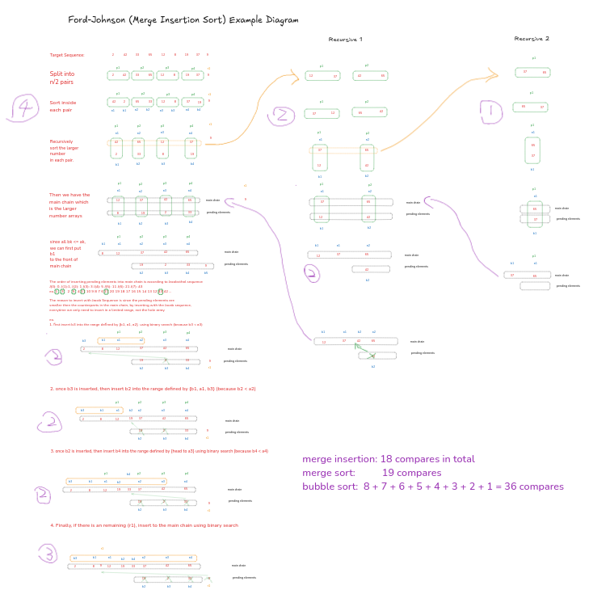
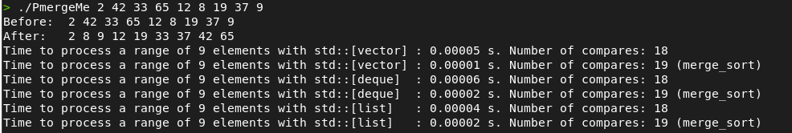
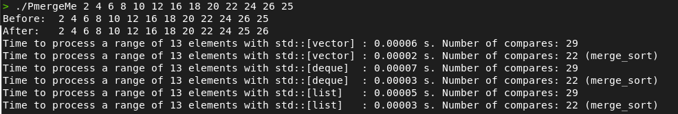
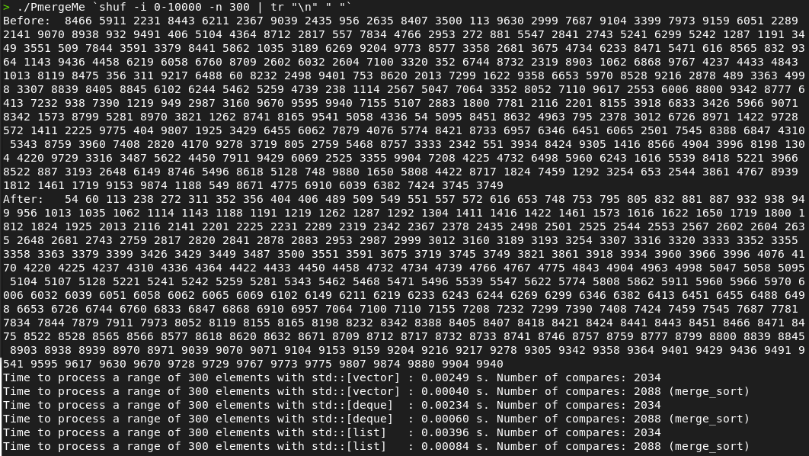

## Ford-Johnson Mersge-insertion sorting algorithm

I believe most of the 42 students like me have difficulties to understand the complicated merge insertion sort. There are limited resources available in the internet and little comprehensive sources that demonstrates how it actually works step by step.

Here I share my sketch while I was trying to understand the mechanism of this algorithm. Hope this is helpful for you!


### Some interesting features of merge insertion 
1. Simliar to merge sort, it is a recursive as well.
2. Merge insertion is not time sufficient. It uses a unique way to split the sequnce and select the candidate to insert back to the main sorted chain. This complexity increases the time it needs to process.
3. Merge insertion works well on reducing the number of "comparisons" especially on worst case sequences. However, if the sequence is not random enough, merge insertion could need more comparisons than merge sort.

### Steps of merge-insertion sort
1. Divide the sequnce in the pairs of 2 elements. If the number of sequence is odd, keep the last one in a ```leftover``` container.
2. Compare the numbers in each pair, identify the **Larger** and the **Smaller** number.
3. Recursively sort the **Larger** number using merge-insertion sort until the **Larger** number is sorted.
4. Now is the critical step and the magical part of the merge-insertion sort.
    - The sorted **Larger** numbers in the pairs form a sequence called  ```mainChain```. This is the tmp container that will have all the sorted numbers.
    - while the **Smaller** numbers in the pairs form a sequence called ```pending```.
    - ```pending``` and ```leftover```are the pending elements. Insert them back to the mainChain in the order of ***Jacobsthal Sequence*** and using ***Binary Search*** to find the insertion position.
5. Based on the number of pending elements, use Jacobsthal Sequence to generate the ***Indice Orders*** that on the pending elements.
    - for example: if there are 5 elements in the pending sequnce, the order of inserting back to mainChain should be: ```1 3 2 5 4```
6. Follow the ***Indice Orders*** to find the element in ```pending``` sequnce, then use ***binary search*** to find the position in ```mainChain``` to insert. The searching range should be the beginin of the mainChain utill the corresponding **Larger** element in the mainChain. Common mistake is trying to compare the range of the whole sequnce of mainChain, which will do extra unnecessary comparisons.
7. If there is a leftover, remember to insert it to mainChain using binary search as well. For the leftoever, it will have to compare the range of the whole mainChain.
8. Finally, copy the mainChain back to the original sequence.

- Here is my sketch of demonstrate the process of merge-insertion sort
    - target sequence: ```2 42 33 65 12 8 19 37 9```


### Put in codes
1. In my ex02_merge_insertion code, I compared three different containers (vector, deque, list), and also compare to their counterpart using merge sort method. So each time there will be 6 output:


2. You can see that merge sort is way faster than merge-insertion sort. And if the sequnce is somewhat partially sorted, or closer to best case, the merge-insertion sort actually takes more comparisons.


3. But if the sequence is random enough, in general merge-insertion takes less comparisons.


### Final thoughts about this exercise
1. I think the main point of CPP09 exercises are to understand different standard containers choose them wisely.
2. I am guessing that learning ford-johnson sorting method is not the main purpose. It is slow and complex algorithm. But via using this slow and complex algorithm, we can better see the performance difference among different containers (data structure).

### References
1. https://codereview.stackexchange.com/questions/116367/ford-johnson-merge-insertion-sort
2. https://medium.com/@sofia.huppertz/cpp09-school42-1efa42df7803