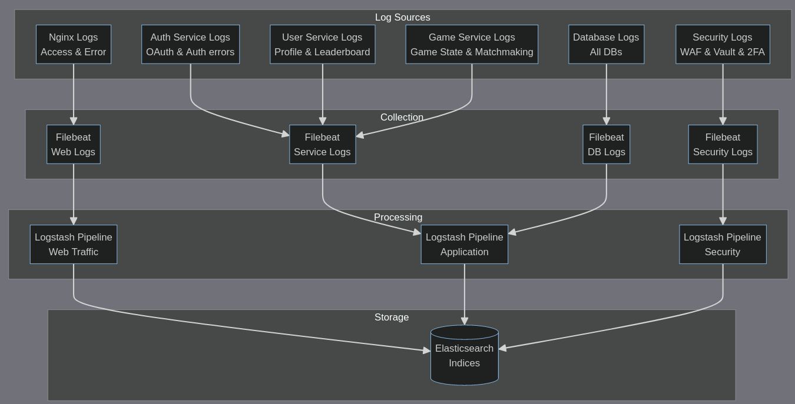

# ELK Log Flow & Log management Concepts

## Log Management Concepts and terms

1. Log Rotation: The practice of periodically archiving current log files and starting new ones to:
    - Prevent logs from consuming too much disk space
    - Make log files more manageable
    - Maintain logs for specific periods.
2. Retention Policy: How long to keep logs
3. Log Levels: `DEBUG`, `INFO`, `WARN`, `ERROR`, etc...
4. Log Aggregation: Collecting logs from mutiple sources
5. Log Parsing: Extracting structured data from logs
6. Log Archiving: Long-term storage of old logs

## Colloecting Logs from Different Services Directly

Q: In my application, nginx serves as the only entrypoint, which means every client traffic must go through nginx. Why don't we collect and monitor only the logs of nginx?

A: We still need to collect logs from multiple services because nginx logs only show the requests/responses but not the following logs:
1. Internal Service errors
2. Application logic issues
3. Database problems
4. Authentication failures
5. Performance bottlenecks in specific services

## Filebeat and Logstash

#### Logstash Benefits:

1. Complex Data Processing:
    - Parse and transform logs in complex ways
    - Enrich data (e.g., adding GeoIP information)
    - Combine multiple data sources
    - Filter unwanted data

2. Data Routing:
    - Send same data to multiple destinations
    - Route different types of logs to different indices
    - Output to multiple systems (not just Elasticsearch)

#### Filebeat Benefits:

1. Log Collection:
    - Lightweight and efficient
    - Handles log rotation
    - Remembers where it left off (in case of system restart)
    - Can handle multiple log formats and sources

2. Reliability:
    - Built-in backpressure handling
    - Guaranteed delivery
    - Handles network issues gracefully

3. Pre-processing:
    - Basic log parsing
    - Can add metadata
    - Can handle multiline logs