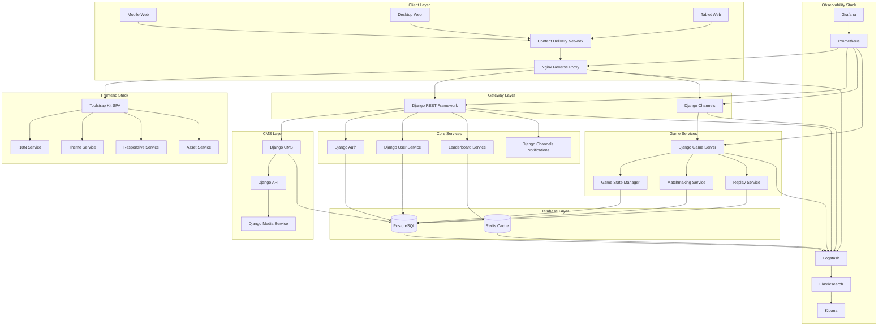

# Transcendence

Document and notes for learning this project

```mermaid
graph TB
    subgraph Client Layer
        MobileWeb[Mobile Web] --> CDN
        DesktopWeb[Desktop Web] --> CDN
        TabletWeb[Tablet Web] --> CDN
        CDN[Content Delivery Network] --> NGINX
    end

    subgraph Frontend Stack
        NGINX[Nginx Reverse Proxy] --> SPA[Toolstrap Kit SPA]
        SPA --> I18N[I18N Service]
        SPA --> ThemeService[Theme Service]
        SPA --> ResponsiveService[Responsive Service]
        SPA --> AssetService[Asset Service]
    end

    subgraph Gateway Layer
        NGINX --> APIGateway[Django REST Framework]
        NGINX --> WSGateway[Django Channels]
    end

    subgraph CMS Layer
        APIGateway --> CMS[Django CMS]
        CMS --> ContentAPI[Django API]
        ContentAPI --> MediaService[Django Media Service]
    end

    subgraph Game Services
        WSGateway --> GameServer[Django Game Server]
        GameServer --> GameState[Game State Manager]
        GameServer --> MatchMaking[Matchmaking Service]
        GameServer --> ReplayService[Replay Service]
    end

    subgraph Core Services
        APIGateway --> AuthService[Django Auth]
        APIGateway --> UserService[Django User Service]
        APIGateway --> LeaderboardService[Leaderboard Service]
        APIGateway --> NotificationService[Django Channels Notifications]
    end

    subgraph Database Layer
        AuthService --> PostgreSQL[(PostgreSQL)]
        UserService --> PostgreSQL
        GameState --> PostgreSQL
        MatchMaking --> PostgreSQL
        ReplayService --> PostgreSQL
        CMS --> PostgreSQL
        LeaderboardService --> Redis[(Redis Cache)]
    end

    subgraph Observability Stack
        PostgreSQL & Redis & NGINX & APIGateway & WSGateway & GameServer --> Logstash
        Logstash --> Elasticsearch
        Elasticsearch --> Kibana
        
        Prometheus --> NGINX & APIGateway & WSGateway & GameServer
        Grafana --> Prometheus
    end
```