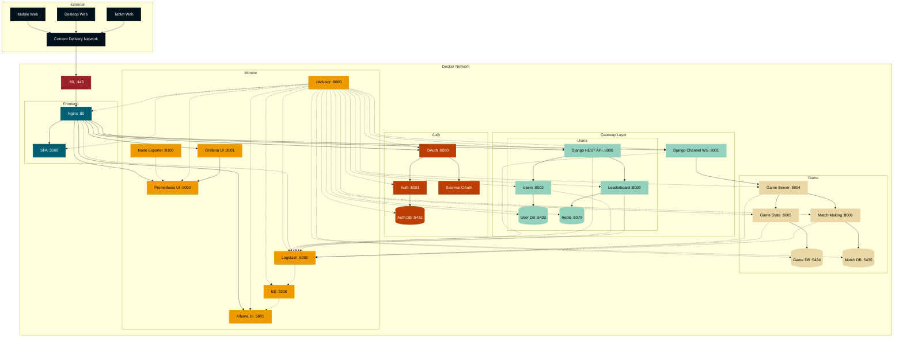
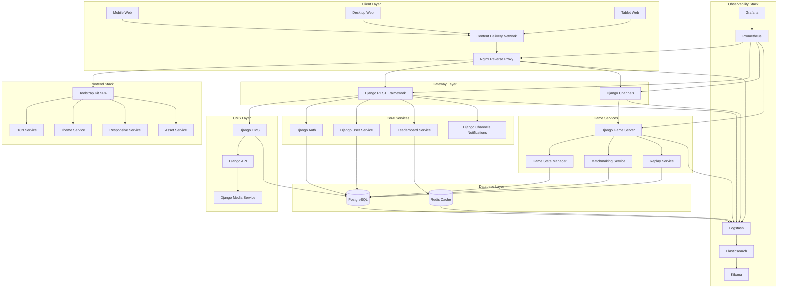
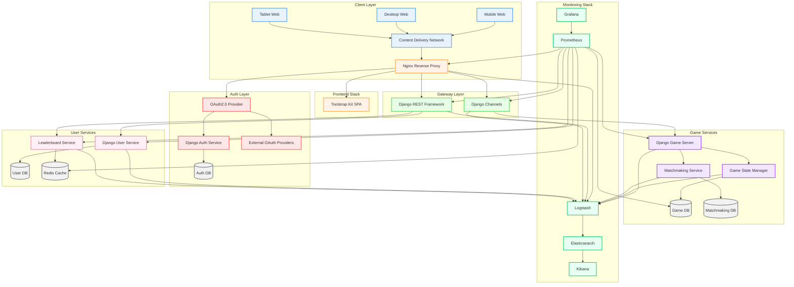

# Transcendence

Document and notes for learning this project

### Final Version_1

```mermaid
graph TB
    %% Style definitions
    classDef external fill:#001219,stroke:#001219,color:#fff,stroke-width:2px
    classDef frontend fill:#005F73,stroke:#005F73,color:#fff,stroke-width:2px
    classDef auth fill:#BB3E03,stroke:#BB3E03,color:#fff,stroke-width:2px
    classDef gateway fill:#94D2BD,stroke:#94D2BD,color:#000,stroke-width:2px
    classDef game fill:#E9D8A6,stroke:#E9D8A6,color:#000,stroke-width:2px
    classDef monitoring fill:#EE9B00,stroke:#EE9B00,color:#000,stroke-width:2px
    classDef port fill:#9B2226,stroke:#9B2226,color:#fff,stroke-width:2px

    subgraph External
        MobileWeb["Mobile Web"] --> CDN
        DesktopWeb["Desktop Web"] --> CDN
        TabletWeb["Tablet Web"] --> CDN
        CDN["Content Delivery Network"]
    end

    CDN --> Port80[":80, :443"]

    subgraph Docker Network
        Port80 --> NGINX["Nginx :80"]
        
        subgraph Frontend
            NGINX --> SPA["SPA :3000"]
        end

        subgraph Auth
            NGINX --> OAuth["OAuth :8080"]
            OAuth --> AuthService["Auth :8081"]
            OAuth --> ExternalOAuth["External OAuth"]
            AuthService --> AuthDB[("Auth DB :5432")]
            class AuthDB auth
        end

        subgraph Gateway Layer
            NGINX --> APIGateway["Django REST API :8000"]
            NGINX --> WSGateway["Django Channel WS :8001"]
            
            subgraph Users
                APIGateway --> UserService["Users :8002"]
                APIGateway --> LeaderboardService["Leaderboard :8003"]
                UserService --> UserDB[("User DB :5433")]
                LeaderboardService --> Redis[("Redis :6379")]
                class UserDB,Redis gateway
            end
        end

        subgraph Game
            WSGateway --> GameServer["Game Server :8004"]
            GameServer --> GameState["Game State :8005"]
            GameServer --> MatchMaking["Match Making :8006"]
            GameState --> GameDB[("Game DB :5434")]
            MatchMaking --> MatchDB[("Match DB :5435")]
            class GameDB,MatchDB game
        end

        subgraph Monitor
            %% Admin UI access through Nginx
            NGINX --> Grafana["Grafana UI :3001"]
            NGINX --> Prometheus["Prometheus UI :9090"]
            NGINX --> Kibana["Kibana UI :5601"]
            
            NodeExp["Node Exporter :9100"] -.-> Prometheus
            
            %% cAdvisor collecting container metrics
            CAdvisor["cAdvisor :8080"] -.-> NGINX & SPA
            CAdvisor -.-> OAuth & AuthService & AuthDB
            CAdvisor -.-> APIGateway & WSGateway
            CAdvisor -.-> UserService & LeaderboardService & UserDB & Redis
            CAdvisor -.-> GameServer & GameState & MatchMaking & GameDB & MatchDB
            
            %% Monitoring stack metrics
            CAdvisor -.-> Elasticsearch["ES :9200"] & Logstash["Logstash :5000"] & Kibana
            CAdvisor -.-> Prometheus
            
            %% Grafana data source
            Grafana --> Prometheus
            
            %% Logging flow
            NGINX & APIGateway & WSGateway -.-> Logstash
            GameServer & GameState & MatchMaking -.-> Logstash
            UserService & LeaderboardService -.-> Logstash
            Logstash -.-> Elasticsearch
            Elasticsearch -.-> Kibana
        end
    end

    %% Apply styles
    class MobileWeb,DesktopWeb,TabletWeb,CDN external
    class Port80 port
    class NGINX,SPA frontend
    class OAuth,AuthService,ExternalOAuth auth
    class APIGateway,WSGateway,UserService,LeaderboardService gateway
    class GameServer,GameState,MatchMaking game
    class Prometheus,Grafana,Logstash,Elasticsearch,Kibana,NodeExp,CAdvisor monitoring
```

### Draft version

```mermaid
graph TB
    subgraph Client Layer
        MobileWeb[Mobile Web] --> CDN
        DesktopWeb[Desktop Web] --> CDN
        TabletWeb[Tablet Web] --> CDN
        CDN[Content Delivery Network] --> NGINX
    end

    subgraph Frontend Stack
        NGINX[Nginx Reverse Proxy] --> SPA[Toolstrap Kit SPA]
        SPA --> I18N[I18N Service]
        SPA --> ThemeService[Theme Service]
        SPA --> ResponsiveService[Responsive Service]
        SPA --> AssetService[Asset Service]
    end

    subgraph Gateway Layer
        NGINX --> APIGateway[Django REST Framework]
        NGINX --> WSGateway[Django Channels]
    end

    subgraph CMS Layer
        APIGateway --> CMS[Django CMS]
        CMS --> ContentAPI[Django API]
        ContentAPI --> MediaService[Django Media Service]
    end

    subgraph Game Services
        WSGateway --> GameServer[Django Game Server]
        GameServer --> GameState[Game State Manager]
        GameServer --> MatchMaking[Matchmaking Service]
        GameServer --> ReplayService[Replay Service]
    end

    subgraph Core Services
        APIGateway --> AuthService[Django Auth]
        APIGateway --> UserService[Django User Service]
        APIGateway --> LeaderboardService[Leaderboard Service]
        APIGateway --> NotificationService[Django Channels Notifications]
    end

    subgraph Database Layer
        AuthService --> PostgreSQL[(PostgreSQL)]
        UserService --> PostgreSQL
        GameState --> PostgreSQL
        MatchMaking --> PostgreSQL
        ReplayService --> PostgreSQL
        CMS --> PostgreSQL
        LeaderboardService --> Redis[(Redis Cache)]
    end

    subgraph Observability Stack
        PostgreSQL & Redis & NGINX & APIGateway & WSGateway & GameServer --> Logstash
        Logstash --> Elasticsearch
        Elasticsearch --> Kibana
        
        Prometheus --> NGINX & APIGateway & WSGateway & GameServer
        Grafana --> Prometheus
    end
```

### Simplified version

```mermaid
graph TB
    %% Style definitions
    classDef clientLayer fill:#e6f3ff,stroke:#4a90e2,stroke-width:2px
    classDef frontendLayer fill:#fff2e6,stroke:#ff9933,stroke-width:2px
    classDef authLayer fill:#ffe6e6,stroke:#ff4d4d,stroke-width:2px
    classDef gatewayLayer fill:#e6ffe6,stroke:#47d147,stroke-width:2px
    classDef gameLayer fill:#f3e6ff,stroke:#9933ff,stroke-width:2px
    classDef userLayer fill:#fff0f5,stroke:#ff66b3,stroke-width:2px
    classDef dbLayer fill:#f2f2f2,stroke:#666666,stroke-width:2px
    classDef monitoringLayer fill:#e6fff2,stroke:#00cc66,stroke-width:2px

    subgraph Client Layer
        MobileWeb[Mobile Web] --> CDN
        DesktopWeb[Desktop Web] --> CDN
        TabletWeb[Tablet Web] --> CDN
        CDN[Content Delivery Network] --> NGINX
    end

    subgraph Frontend Stack
        NGINX[Nginx Reverse Proxy] --> SPA[Toolstrap Kit SPA]
    end

    subgraph Auth Layer
        NGINX --> OAuth[OAuth2.0 Provider]
        OAuth --> AuthService[Django Auth Service]
        AuthService --> AuthDB[(Auth DB)]
        OAuth --> ExternalOAuth[External OAuth Providers]
    end

    subgraph Gateway Layer
        NGINX --> APIGateway[Django REST Framework]
        NGINX --> WSGateway[Django Channels]
    end

    subgraph User Services
        APIGateway --> UserService[Django User Service]
        APIGateway --> LeaderboardService[Leaderboard Service]
        UserService --> UserDB[(User DB)]
        LeaderboardService --> Redis[(Redis Cache)]
    end

    subgraph Game Services
        WSGateway --> GameServer[Django Game Server]
        GameServer --> GameState[Game State Manager]
        GameServer --> MatchMaking[Matchmaking Service]
        GameState --> GameDB[(Game DB)]
        MatchMaking --> MatchDB[(Matchmaking DB)]
    end

    subgraph Monitoring Stack
        %% Prometheus monitors critical paths
        Prometheus --> NGINX
        Prometheus --> APIGateway
        Prometheus --> WSGateway
        Prometheus --> GameServer
        Prometheus --> UserService
        Prometheus --> LeaderboardService
        Prometheus --> GameDB
        Prometheus --> Redis
        Grafana --> Prometheus

        %% ELK Stack for detailed logging
        NGINX & APIGateway & WSGateway --> Logstash
        GameServer & GameState & MatchMaking --> Logstash
        UserService & LeaderboardService --> Logstash
        Logstash --> Elasticsearch
        Elasticsearch --> Kibana
    end

    %% Apply styles
    class MobileWeb,DesktopWeb,TabletWeb,CDN clientLayer
    class NGINX,SPA frontendLayer
    class OAuth,AuthService,ExternalOAuth authLayer
    class APIGateway,WSGateway gatewayLayer
    class GameServer,GameState,MatchMaking gameLayer
    class UserService,LeaderboardService userLayer
    class AuthDB,GameDB,MatchDB,UserDB,Redis dbLayer
    class Prometheus,Grafana,Logstash,Elasticsearch,Kibana monitoringLayer
```

### Detailed version

```mermaid
graph TB
    subgraph Client Layer
        MobileWeb[Mobile Web] --> CDN
        DesktopWeb[Desktop Web] --> CDN
        TabletWeb[Tablet Web] --> CDN
        CDN[Content Delivery Network] --> NGINX
    end

    subgraph Frontend Stack
        NGINX[Nginx Reverse Proxy] --> SPA[Toolstrap Kit SPA]
        SPA --> I18N[I18N Service]
        SPA --> ThemeService[Theme Service]
        SPA --> ResponsiveService[Responsive Service]
        SPA --> AssetService[Asset Service]
    end

    subgraph Auth Layer
        NGINX --> OAuth[OAuth2.0 Provider]
        OAuth --> AuthService[Django Auth Service]
        AuthService --> AuthDB[(Auth DB)]
        
        %% External OAuth providers
        OAuth --> Google[Google OAuth]
        OAuth --> GitHub[GitHub OAuth]
        OAuth --> Discord[Discord OAuth]
    end

    subgraph Gateway Layer
        NGINX --> APIGateway[Django REST Framework]
        NGINX --> WSGateway[Django Channels]
    end

    subgraph CMS Layer
        APIGateway --> CMS[Django CMS]
        CMS --> ContentAPI[Django API]
        ContentAPI --> MediaService[Django Media Service]
        CMS --> ContentDB[(CMS DB)]
        MediaService --> MediaDB[(Media DB)]
    end

    subgraph Game Services
        WSGateway --> GameServer[Django Game Server]
        GameServer --> GameState[Game State Manager]
        GameServer --> MatchMaking[Matchmaking Service]
        GameServer --> ReplayService[Replay Service]
        GameState --> GameDB[(Game DB)]
        MatchMaking --> MatchDB[(Matchmaking DB)]
        ReplayService --> ReplayDB[(Replay DB)]
    end

    subgraph User Services
        APIGateway --> UserService[Django User Service]
        APIGateway --> LeaderboardService[Leaderboard Service]
        APIGateway --> NotificationService[Django Channels Notifications]
        UserService --> UserDB[(User DB)]
        LeaderboardService --> Redis[(Redis Cache)]
        NotificationService --> NotifyDB[(Notification DB)]
    end

    subgraph Observability Stack
        %% Prometheus monitoring all services
        Prometheus --> SPA & OAuth & AuthService & APIGateway & WSGateway
        Prometheus --> CMS & ContentAPI & MediaService
        Prometheus --> GameServer & GameState & MatchMaking & ReplayService
        Prometheus --> UserService & LeaderboardService & NotificationService
        Prometheus --> AuthDB & ContentDB & MediaDB & GameDB & MatchDB & ReplayDB & UserDB & NotifyDB & Redis
        Grafana --> Prometheus

        %% Logging
        SPA & OAuth & AuthService & APIGateway & WSGateway --> Logstash
        CMS & ContentAPI & MediaService --> Logstash
        GameServer & GameState & MatchMaking & ReplayService --> Logstash
        UserService & LeaderboardService & NotificationService --> Logstash
        Logstash --> Elasticsearch
        Elasticsearch --> Kibana
    end
```