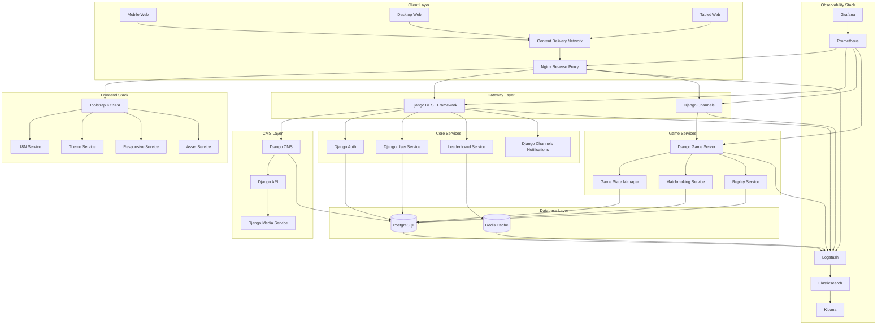
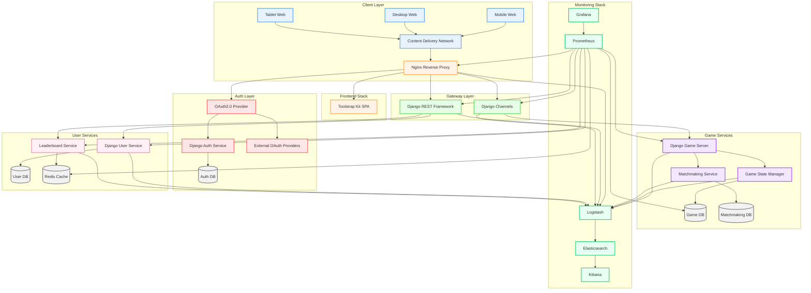

# Transcendence

Document and notes for learning this project

### Draft version

```mermaid
graph TB
    subgraph Client Layer
        MobileWeb[Mobile Web] --> CDN
        DesktopWeb[Desktop Web] --> CDN
        TabletWeb[Tablet Web] --> CDN
        CDN[Content Delivery Network] --> NGINX
    end

    subgraph Frontend Stack
        NGINX[Nginx Reverse Proxy] --> SPA[Toolstrap Kit SPA]
        SPA --> I18N[I18N Service]
        SPA --> ThemeService[Theme Service]
        SPA --> ResponsiveService[Responsive Service]
        SPA --> AssetService[Asset Service]
    end

    subgraph Gateway Layer
        NGINX --> APIGateway[Django REST Framework]
        NGINX --> WSGateway[Django Channels]
    end

    subgraph CMS Layer
        APIGateway --> CMS[Django CMS]
        CMS --> ContentAPI[Django API]
        ContentAPI --> MediaService[Django Media Service]
    end

    subgraph Game Services
        WSGateway --> GameServer[Django Game Server]
        GameServer --> GameState[Game State Manager]
        GameServer --> MatchMaking[Matchmaking Service]
        GameServer --> ReplayService[Replay Service]
    end

    subgraph Core Services
        APIGateway --> AuthService[Django Auth]
        APIGateway --> UserService[Django User Service]
        APIGateway --> LeaderboardService[Leaderboard Service]
        APIGateway --> NotificationService[Django Channels Notifications]
    end

    subgraph Database Layer
        AuthService --> PostgreSQL[(PostgreSQL)]
        UserService --> PostgreSQL
        GameState --> PostgreSQL
        MatchMaking --> PostgreSQL
        ReplayService --> PostgreSQL
        CMS --> PostgreSQL
        LeaderboardService --> Redis[(Redis Cache)]
    end

    subgraph Observability Stack
        PostgreSQL & Redis & NGINX & APIGateway & WSGateway & GameServer --> Logstash
        Logstash --> Elasticsearch
        Elasticsearch --> Kibana
        
        Prometheus --> NGINX & APIGateway & WSGateway & GameServer
        Grafana --> Prometheus
    end
```

### Simplified version

```mermaid
graph TB
    %% Style definitions
    classDef clientLayer fill:#e6f3ff,stroke:#4a90e2,stroke-width:2px
    classDef frontendLayer fill:#fff2e6,stroke:#ff9933,stroke-width:2px
    classDef authLayer fill:#ffe6e6,stroke:#ff4d4d,stroke-width:2px
    classDef gatewayLayer fill:#e6ffe6,stroke:#47d147,stroke-width:2px
    classDef gameLayer fill:#f3e6ff,stroke:#9933ff,stroke-width:2px
    classDef userLayer fill:#fff0f5,stroke:#ff66b3,stroke-width:2px
    classDef dbLayer fill:#f2f2f2,stroke:#666666,stroke-width:2px
    classDef monitoringLayer fill:#e6fff2,stroke:#00cc66,stroke-width:2px

    subgraph Client Layer
        MobileWeb[Mobile Web] --> CDN
        DesktopWeb[Desktop Web] --> CDN
        TabletWeb[Tablet Web] --> CDN
        CDN[Content Delivery Network] --> NGINX
    end

    subgraph Frontend Stack
        NGINX[Nginx Reverse Proxy] --> SPA[Toolstrap Kit SPA]
    end

    subgraph Auth Layer
        NGINX --> OAuth[OAuth2.0 Provider]
        OAuth --> AuthService[Django Auth Service]
        AuthService --> AuthDB[(Auth DB)]
        OAuth --> ExternalOAuth[External OAuth Providers]
    end

    subgraph Gateway Layer
        NGINX --> APIGateway[Django REST Framework]
        NGINX --> WSGateway[Django Channels]
    end

    subgraph Game Services
        WSGateway --> GameServer[Django Game Server]
        GameServer --> GameState[Game State Manager]
        GameServer --> MatchMaking[Matchmaking Service]
        GameState --> GameDB[(Game DB)]
        MatchMaking --> MatchDB[(Matchmaking DB)]
    end

    subgraph User Services
        APIGateway --> UserService[Django User Service]
        APIGateway --> LeaderboardService[Leaderboard Service]
        UserService --> UserDB[(User DB)]
        LeaderboardService --> Redis[(Redis Cache)]
    end

    subgraph Monitoring Stack
        %% Prometheus monitors critical paths
        Prometheus --> NGINX
        Prometheus --> APIGateway
        Prometheus --> WSGateway
        Prometheus --> GameServer
        Prometheus --> UserService
        Prometheus --> LeaderboardService
        Prometheus --> GameDB
        Prometheus --> Redis
        Grafana --> Prometheus

        %% ELK Stack for detailed logging
        NGINX & APIGateway & WSGateway --> Logstash
        GameServer & GameState & MatchMaking --> Logstash
        UserService & LeaderboardService --> Logstash
        Logstash --> Elasticsearch
        Elasticsearch --> Kibana
    end

    %% Apply styles
    class MobileWeb,DesktopWeb,TabletWeb,CDN clientLayer
    class NGINX,SPA frontendLayer
    class OAuth,AuthService,ExternalOAuth authLayer
    class APIGateway,WSGateway gatewayLayer
    class GameServer,GameState,MatchMaking gameLayer
    class UserService,LeaderboardService userLayer
    class AuthDB,GameDB,MatchDB,UserDB,Redis dbLayer
    class Prometheus,Grafana,Logstash,Elasticsearch,Kibana monitoringLayer
```

### Detailed version

```mermaid
graph TB
    subgraph Client Layer
        MobileWeb[Mobile Web] --> CDN
        DesktopWeb[Desktop Web] --> CDN
        TabletWeb[Tablet Web] --> CDN
        CDN[Content Delivery Network] --> NGINX
    end

    subgraph Frontend Stack
        NGINX[Nginx Reverse Proxy] --> SPA[Toolstrap Kit SPA]
        SPA --> I18N[I18N Service]
        SPA --> ThemeService[Theme Service]
        SPA --> ResponsiveService[Responsive Service]
        SPA --> AssetService[Asset Service]
    end

    subgraph Auth Layer
        NGINX --> OAuth[OAuth2.0 Provider]
        OAuth --> AuthService[Django Auth Service]
        AuthService --> AuthDB[(Auth DB)]
        
        %% External OAuth providers
        OAuth --> Google[Google OAuth]
        OAuth --> GitHub[GitHub OAuth]
        OAuth --> Discord[Discord OAuth]
    end

    subgraph Gateway Layer
        NGINX --> APIGateway[Django REST Framework]
        NGINX --> WSGateway[Django Channels]
    end

    subgraph CMS Layer
        APIGateway --> CMS[Django CMS]
        CMS --> ContentAPI[Django API]
        ContentAPI --> MediaService[Django Media Service]
        CMS --> ContentDB[(CMS DB)]
        MediaService --> MediaDB[(Media DB)]
    end

    subgraph Game Services
        WSGateway --> GameServer[Django Game Server]
        GameServer --> GameState[Game State Manager]
        GameServer --> MatchMaking[Matchmaking Service]
        GameServer --> ReplayService[Replay Service]
        GameState --> GameDB[(Game DB)]
        MatchMaking --> MatchDB[(Matchmaking DB)]
        ReplayService --> ReplayDB[(Replay DB)]
    end

    subgraph User Services
        APIGateway --> UserService[Django User Service]
        APIGateway --> LeaderboardService[Leaderboard Service]
        APIGateway --> NotificationService[Django Channels Notifications]
        UserService --> UserDB[(User DB)]
        LeaderboardService --> Redis[(Redis Cache)]
        NotificationService --> NotifyDB[(Notification DB)]
    end

    subgraph Observability Stack
        %% Prometheus monitoring all services
        Prometheus --> SPA & OAuth & AuthService & APIGateway & WSGateway
        Prometheus --> CMS & ContentAPI & MediaService
        Prometheus --> GameServer & GameState & MatchMaking & ReplayService
        Prometheus --> UserService & LeaderboardService & NotificationService
        Prometheus --> AuthDB & ContentDB & MediaDB & GameDB & MatchDB & ReplayDB & UserDB & NotifyDB & Redis
        Grafana --> Prometheus

        %% Logging
        SPA & OAuth & AuthService & APIGateway & WSGateway --> Logstash
        CMS & ContentAPI & MediaService --> Logstash
        GameServer & GameState & MatchMaking & ReplayService --> Logstash
        UserService & LeaderboardService & NotificationService --> Logstash
        Logstash --> Elasticsearch
        Elasticsearch --> Kibana
    end
```