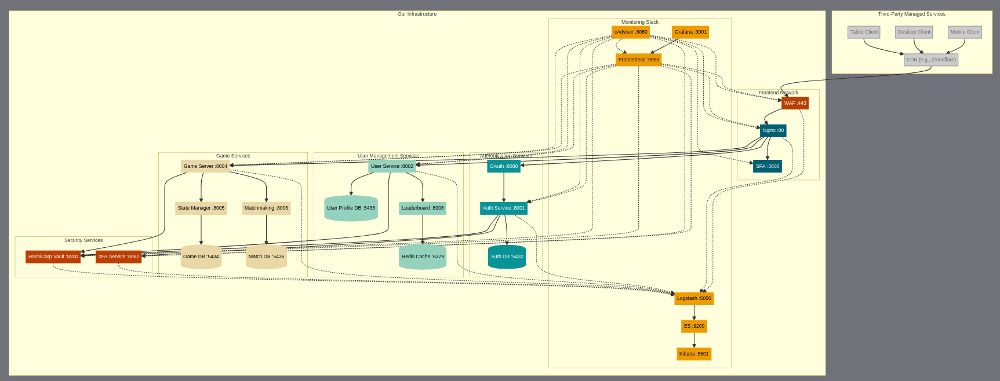

# Transcendence

Document and notes for learning this project

### Final Version_1

#### Flow with All Cybersecurity Modules

#### Flow explanation

### Draft version

### Simplified version

### Detailed version
